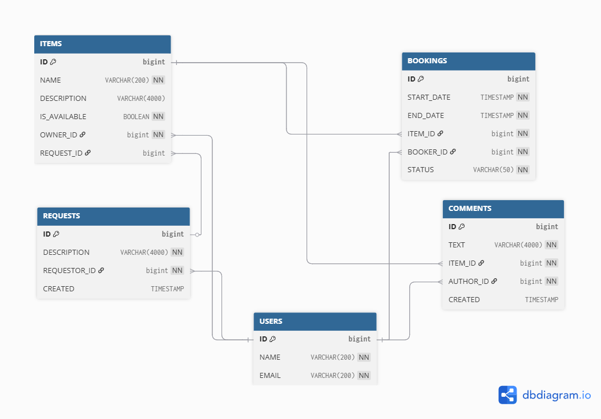

# 📦 ShareIt — REST API для шеринга вещей

Приложение предназначено для обмена вещами между пользователями:  
- 🧍 пользователи добавляют свои вещи;  
- 🕒 другие могут бронировать их на определённое время;  
- 💬 после завершения аренды можно оставить отзыв;  
- 📦 пользователи могут оставлять запросы на нужные им вещи;  
- ✅ владелец подтверждает или отклоняет бронирование.

---

## ⚙️ Основные пакеты

| Пакет | Назначение | Статус |
|:----------------------------|:------------|:---------------------------------|
| `ru.practicum.shareit.user` | управление пользователями | ✅ готов к сдаче в Sprint 15 |
| `ru.practicum.shareit.item` | управление вещами и комментариями | ✅ готов к сдаче в Sprint 15 |
| `ru.practicum.shareit.booking` | бронирование вещей пользователями | ✅ готов к сдаче в Sprint 15 |
| `ru.practicum.shareit.request` | запросы на вещи | ⚙️ заготовка на следующий спринт |
| `ru.practicum.shareit.common` | глобальные обработчики ошибок и утилиты | ✅ готов к сдаче в Sprint 15 |

---

### 🗄️ Структура базы данных в ER диаграмме

---

## 📁 Детальное описание пакетов

### 🧍 `user`
Пакет отвечает за управление пользователями приложения.
- Создание, обновление, получение и удаление пользователей.  
- Проверка уникальности email при создании и изменении.  
- Централизованная обработка ошибок при некорректных операциях.  
- Реализовано через `UserServiceImpl`, `UserRepository` и `UserMapper`.  

Ключевые методы:
- `createUser(UserDto dto)` — регистрация нового пользователя.  
- `updateUser(Long userId, UserDto dto)` — частичное обновление данных.  
- `getUserById(Long userId)` — получение пользователя по ID.  
- `getAllUsers()` — получение списка всех пользователей.  
- `deleteUser(Long userId)` — удаление пользователя.

---

### 📦 `item`
Пакет управляет вещами, принадлежащими пользователям, и комментариями к ним.
- Добавление и редактирование вещей их владельцами.  
- Просмотр доступных вещей и поиск по названию/описанию.  
- Добавление отзывов (только пользователи, арендовавшие вещь и завершившие аренду).  
- Определение ближайших бронирований (последнее и следующее).  

Ключевые методы (`ItemServiceImpl`):
- `createItem(Long userId, ItemDto dto)` — создание новой вещи.  
- `updateItem(Long userId, Long itemId, ItemDto dto)` — обновление существующей вещи.  
- `getItemById(Long userId, Long itemId)` — получение вещи по ID.  
- `getItemsByOwner(Long userId)` — получение всех вещей владельца.  
- `searchItems(String text)` — поиск доступных вещей.  
- `addComment(Long userId, Long itemId, CommentDto commentDto)` — добавление комментария после окончания аренды.

---

### 🕒 `booking`
Пакет реализует функционал бронирования вещей между пользователями.
- Создание бронирований доступных вещей.  
- Подтверждение или отклонение бронирования владельцем.  
- Получение бронирований по статусу (`ALL`, `CURRENT`, `PAST`, `FUTURE`, `WAITING`, `REJECTED`).  
- Проверка прав доступа — бронирование доступно только не владельцам.  
- Маппинг данных с расширенной DTO (`BookingResponseDto`) для отображения информации о пользователе и вещи.  

Ключевые методы (`BookingServiceImpl`):
- `createBooking(Long userId, BookingDto dto)` — создание нового бронирования.  
- `approveBooking(Long ownerId, Long bookingId, boolean approved)` — подтверждение/отклонение владельцем.  
- `getBookingById(Long userId, Long bookingId)` — получение информации о бронировании.  
- `getBookingsByBooker(Long userId, BookingState state)` — список бронирований пользователя.  
- `getBookingsForOwner(Long userId, BookingState state)` — список бронирований для владельца вещей.

---

## 🔐 Общие правила

- Все запросы выполняются с обязательным заголовком:  
  `X-Sharer-User-Id` — идентификатор пользователя, выполняющего действие.  
- Ответы возвращаются в формате `application/json`.  
- Ошибки обрабатываются централизованно через `ExceptionControllerAdvice`.

---

## 🚀 Технологии проекта

- **Java 21**  
- **Spring Boot 3** (Web, Data JPA, Validation)  
- **Hibernate / JPA** — работа с базой данных  
- **H2** — основная СУБД   
- **Lombok** — сокращение шаблонного кода  
- **Slf4j / Logback** — логирование

---
